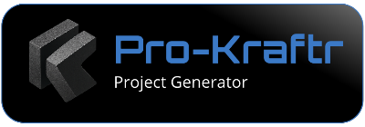

# Pro-Kraftr

**Pro-Kraftr** is a lightweight, developer-first scaffolding tool designed to speed up project initialization through reusable templates — for CLI lovers, GUI fans, and contributors alike.

Whether you're coding a quick prototype, writing a research paper, or formalizing a business plan, **Pro-Kraftr** gives you a structured head start with folders, boilerplate, and more — so you can get straight to the real work.

⚡ **Perfect for devs, researchers, hobbyists, and educators** who want to:
- Eliminate repetitive setup
- Learn or enforce good project architecture
- Extend with their own templates or tooling

✨ Features:
- CLI-first with an optional GUI built on `customtkinter`
- JSON-powered templates with live placeholder replacement
- Built-in categories: development, research, business
- Create, test, and publish your own templates
- 100% open-source and designed for collaboration

---
Craft your next project like a pro. 🛠️

## 🛣️ Pro-Kraftr Roadmap

### ✅ Phase 1: Core Functionality (MVP)

#### 🔧 Base Setup
- [x] CLI + template parser engine
- [x] JSON templates with folder/file definitions and placeholders
- [x] Dry-run preview and real generation
- [x] Modular structure (loader, generator, utils)

#### 📦 Templates (for test purposes)
- [x] `python-script` (starter script)
- [x] `thesis-latex` (research starter)
- [x] `proposal-doc` (basic business layout)

#### CLI
- [x] `list` – View available templates
- [x] `create` – Start new project from a template
- [x] Inject variables via prompt or config

### 🖼️ Phase 2: GUI (User Interface)

- [x] Category + template selector
- [x] Template preview (description + file tree)
- [x] Field validation and error display
- [x] Navigation between form and config
- [ ] Live placeholder-based preview of files
- [ ] Run generation and confirmation screen

### 🌱 Phase 3: Template Ecosystem

- [ ] Global vs local templates
- [ ] Git-based template installation
- [ ] Tagging and metadata
- [ ] GUI/CLI to add, test, and publish new templates

### 🌍 Phase 4: Community Polish

- [ ] CONTRIBUTING.md with guide for adding templates
- [ ] Project docs and usage guide
- [ ] GitHub Pages showcase
- [ ] PyPI packaging + install instructions
- [ ] Invite-first contributor model

---

🚀 Whether you're starting a hobby project or working with a team — **Pro-Kraftr** removes the friction so you can build fast, clean, and repeatably.
